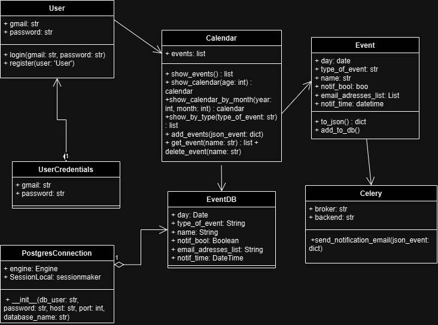
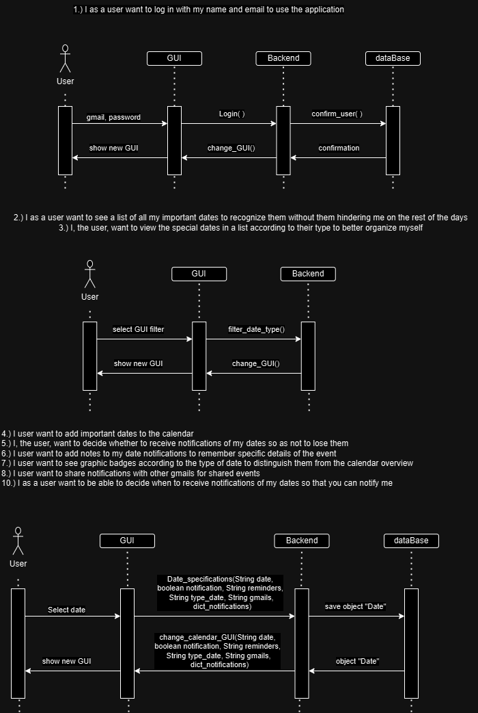
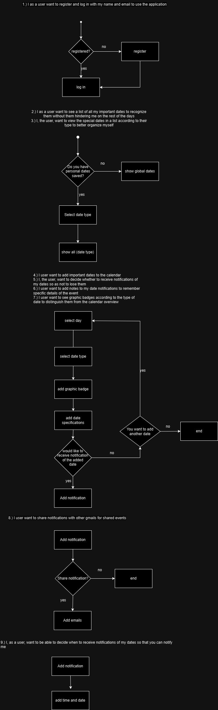
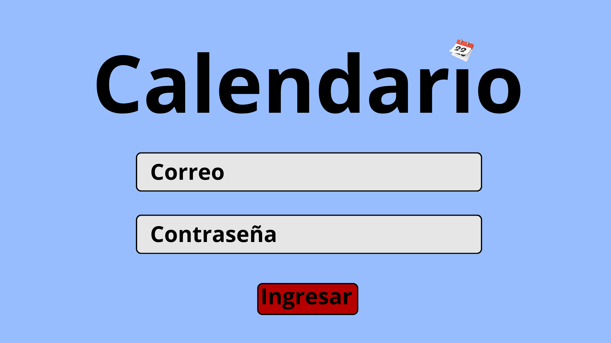
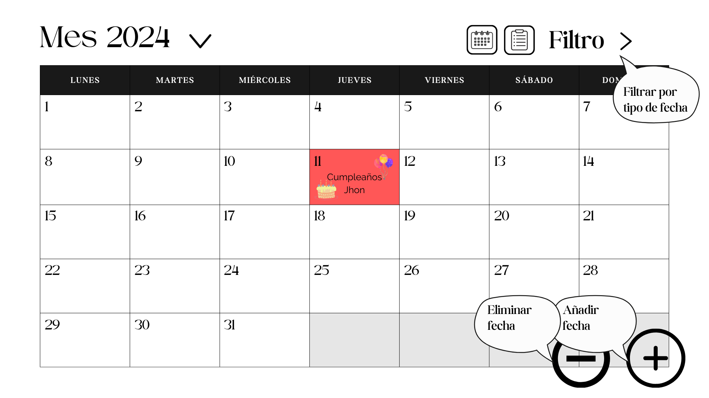
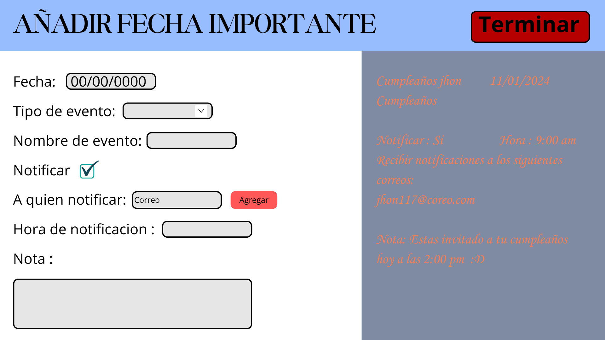
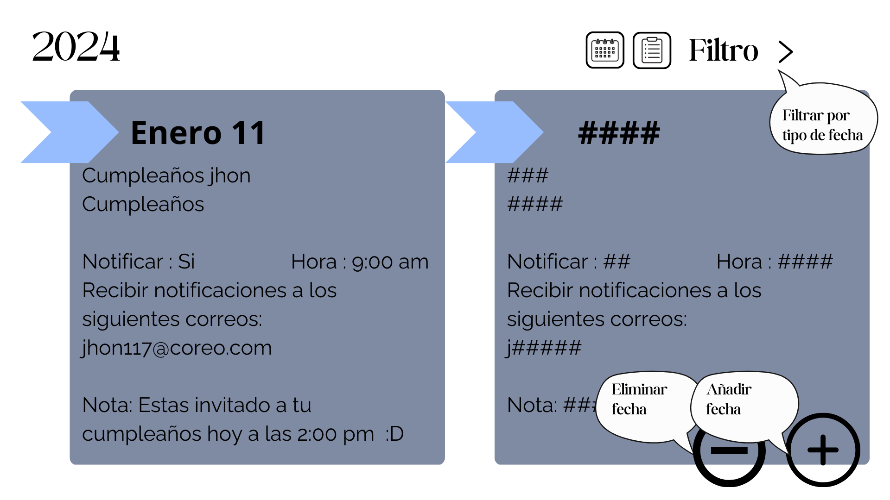

# User Stories

- As a user, I want to register and log in with my name and email to use the application.

- As a user, I want to see a list of all important dates to recognize them without cluttering the rest of the days.

- As a user, I want to view special dates in a list according to their type to better organize myself.

- As a user, I want to add important dates to the calendar.

- As a user, I want to decide whether to receive notifications for my dates to avoid missing them.

- As a user, I want to add notes to my date notifications to remember specific event details.

- As a user, I want to see graphical indicators according to the type of date to distinguish them from the calendar's general view.

- As a user, I want to share notifications with other Gmail accounts for shared events.

- As a user, I want to be able to decide when to receive notifications for my dates to be notified.

# Technical Design
Architecture Overview:
The Calendar Task Organizer application follows a client-server architecture. The backend is implemented using Python with FastAPI, SQLAlchemy for database management, and Celery for handling asynchronous tasks like sending notifications. The frontend is developed using Django framework.

## Technical Decisions:
Backend Framework:

- FastAPI is chosen for the backend due to its high performance and ease of use in building REST APIs.
Database Management:

- PostgreSQL is selected as the database management system for its reliability and scalability.
Asynchronous Task Handling:

- Celery is utilized for asynchronous task handling, such as sending notifications, to improve application responsiveness.

User Authentication:

- JWT (JSON Web Tokens) are used for user authentication to provide secure access to the application.
Notification Service:

- Yagmail library is employed for sending email notifications to users.

# Diagrams

## Diagram class

## Diagram Sequence

## Diagram Activities

# UI Mockups
Login Page:

Main Page:

Add Event Form:

Calendar Events Page:

# Web Service Design
Endpoints:
- User Registration: POST /user/register
- User Login: POST /login
- Add Event: POST /user/save_event
- Delete Event: DELETE /user/delete_event/{name}
- View Events: GET /view_events
- View Monthly Calendar: GET /calendar/by_month/{year}/{month}
- View Events by Type: GET /calendar/show_by_type/{type}
- View Events by Name: GET /calendar/show_by_name/{name}
